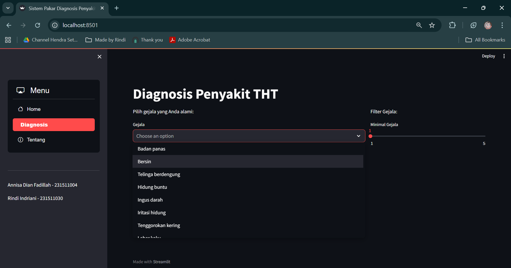
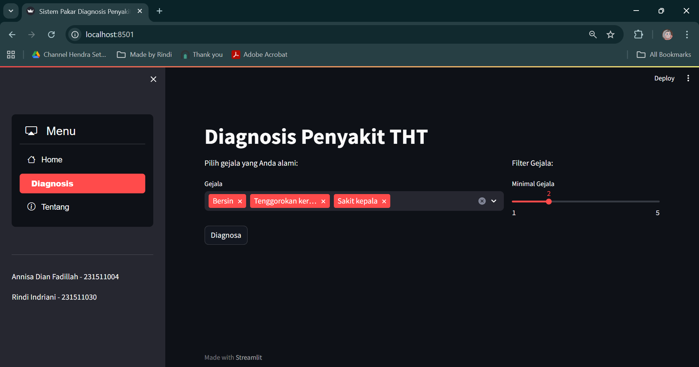
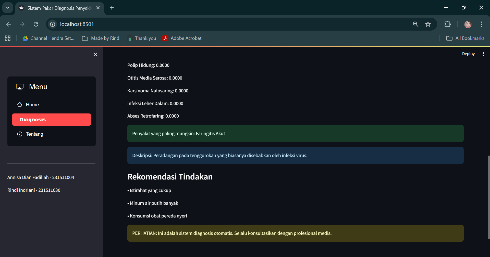

# ENT Disease Diagnosis Web Application

## Overview

An interactive web application built with Python and Streamlit that implements the Naive Bayes algorithm based on Bayes’ Theorem to support probabilistic diagnosis of ENT (THT) diseases.

This project was initially developed as part of a collaborative academic assignment for the _Statistics and Probability_ course and has been further refined, documented, and presented as a personal portfolio implementation to demonstrate the practical application of probability concepts in informatics.

---

## Features

- Probabilistic diagnosis using Naive Bayes with Laplace smoothing
- Interactive and user-friendly interface built with Streamlit
- Visualization of disease probability distributions
- Recommendation output based on the most probable diagnosis
- Lightweight and easy to run locally

---

## Methodology

The system applies Bayes’ Theorem to calculate the probability of ENT diseases based on selected symptoms.  
The calculation process includes:

- **Prior Probability**: Initial probability of each disease
- **Likelihood**: Probability of symptoms given a disease
- **Posterior Probability**: Final probability of each disease given the selected symptoms

To avoid zero-probability issues, Laplace smoothing is applied. The disease with the highest posterior probability is presented as the most likely diagnosis.

---

## Tech Stack

- Python
- Streamlit
- Plotly (for visualization)

---

## Application Preview






---

## How to Run Locally

1. Clone this repository:
   ```bash
   git clone https://github.com/rindrn/tht-diagnosis-bayes-streamlit.git
   ```
2. Navigate to the project directory:
   ```bash
   cd tht-diagnosis-bayes-streamlit
   ```
3. Install required dependencies:
   ```bash
   pip install -r requirements.txt
   ```
4. Run the application:
   ```bash
   streamlit run app.py
   ```

---

## Notes

- This application is intended for educational and demonstration purposes only.
- It does not replace professional medical diagnosis.
- The original project was developed collaboratively. This repository represents my personal refinement, documentation, and presentation for portfolio purposes.
